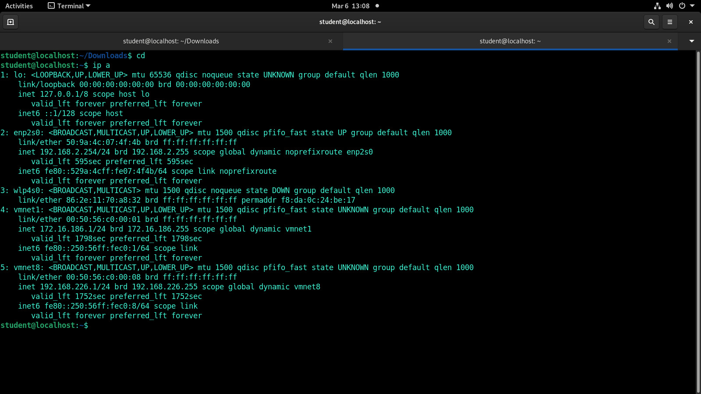
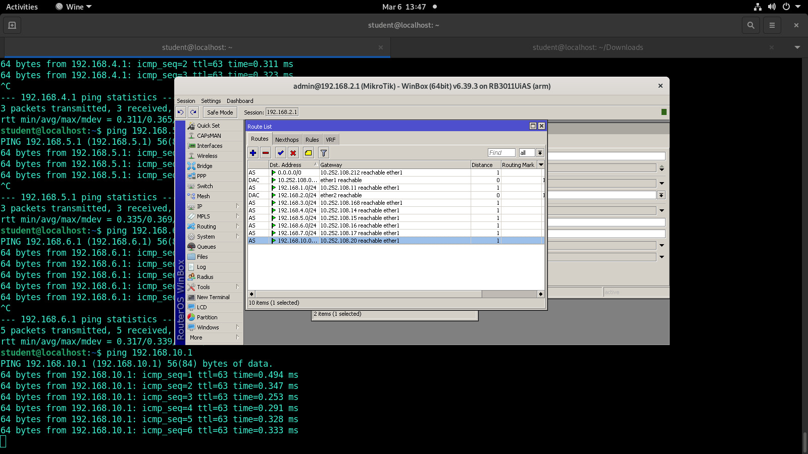
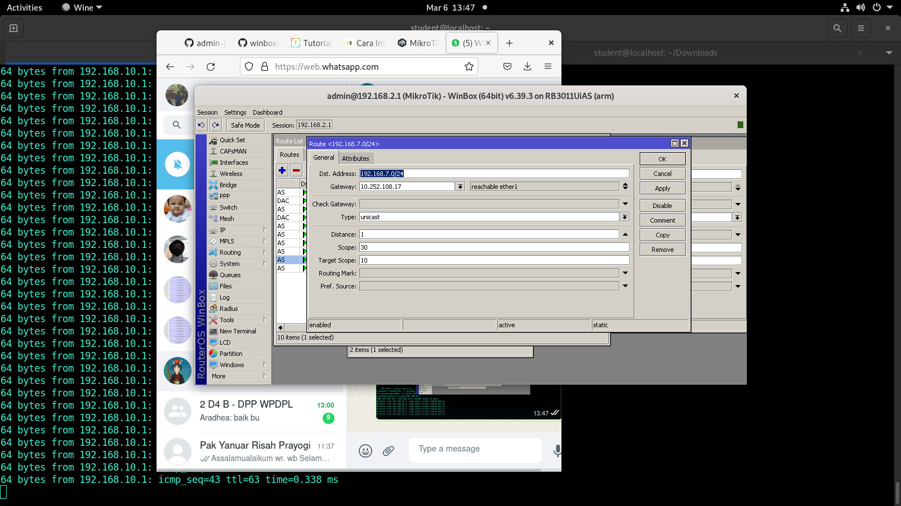
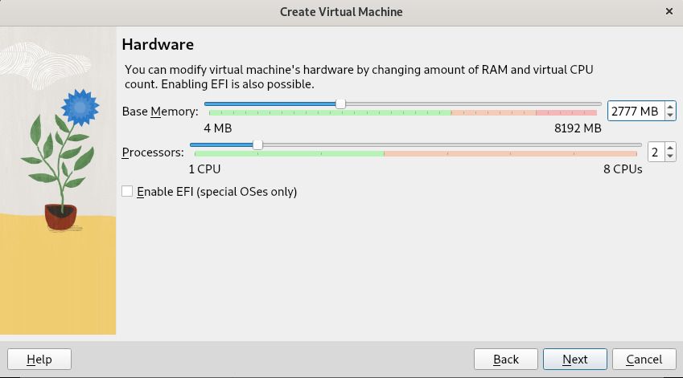
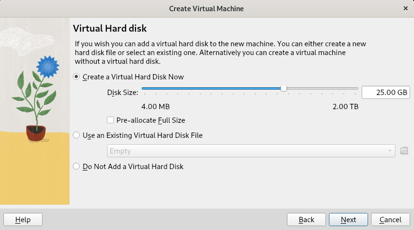
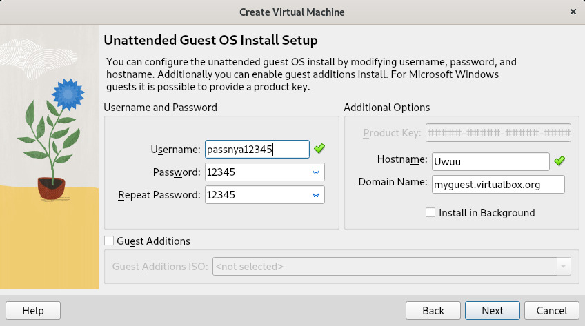
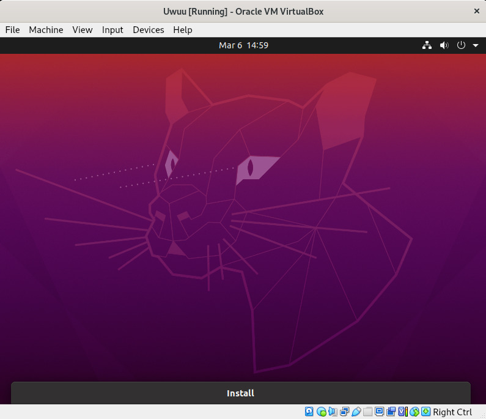

## Mencatat IP Address Pc

ip pc berada pada enp2s0 yaitu 192.168.2.254.

## Mengakses Winbox64.exe 

Winbox64.exe dapat dijalankan di debian engan cara menginstall wine terlebih dahulu. Setelah wine terinstall, selanjutnya mendownload winbox64.exe dan letakkan pada folder pada pc. Kemudian buka direktori tempat menyimpan file winbox64.exe. Jalankan perintah "wine winbox64.exe". Tampilan winbox pada foto dibawah ini.

Setelah winbox berhasil dibuka, untuk menyambungkan semua pc yang berada di lab, kita harus melakukan setting routing tiap pc satu per satu. Proses routing akan digambarkan dibawah ini.

Dengan dst address diisi dengan network address pc yang ingin dituju, gateway diisi dengan network ethernet 1 pada mikrotik pc yang ingin dituju.

## Instalasi Virtualbox

Hal pertama yang harus dilakukan adalah menambahkan "contrib" dan "non-free" components di /etc/apt/sources.list.

kemudian melakukan 
> sudo apt update

setelah proses update selesai selanjutnya kita menjalankan perintah untuk install virtualboxnya

>sudo apt install virtualbox

Install virtualbox dengan menggunakan petunjuk yang ada pada debian copy virtual machine yang sudah ada sebelumnya.

Ketika sudah menginstall virtualbox, setting virtual machine untuk menginstall ubuntu yang sudah disiapkan

 - Beri nama virtual machine dan OS yang akan diinstall

- Tentukan jumlah memori dan yang digunakan untuk virtual OS

- Tentukan jumlah storage dan yang digunakan untuk virtual OS

- Masukkan username dan password untuk membuat user baru

### Ubuntu

Setelah install virtualbox dan setting virtual machine, install OS ubuntu pada virtual machine yang sudah dibuat. Berikut tampilan awal OS Ubuntu setelah diinstall.

